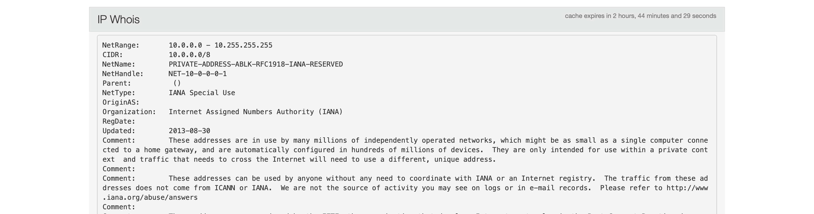

# Lab 12

## Tasks

* **Task 1:** Create a GET workflow action that opens a new browser window with information about the source IP address.

```
index=security sourcetype=linux_secure src_ip=*
```




* **Task 2:** Create a POST workflow action that will use fields from events with errors to create a ticket in the IT ticket tracking system.

```
index=_* OR index=* sourcetype=sales_entries result=error
```


* **Task 3:** Create a Search workflow action that performs a search for all failed password events associated with a specific IP address.

```
index=security sourcetype=linux_secure failed src_ip=107.3.146.207
```


