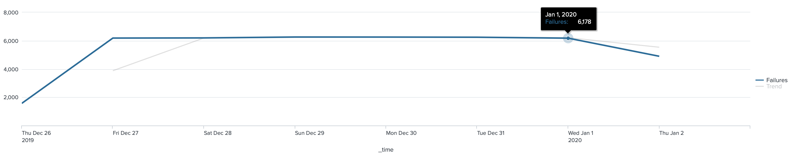

# Lab 4

## Task 1

* Task 1: Display web server failures during the last 7 days in a timechart with a trendline.

```
index=security sourcetype=linux_secure fail*
| timechart span=1d count as "Failures"
| trendline sma2(Failures) as Trend
```



* Task 2: Display the sales count of strategy games per day at Buttercup Games physical sales locations (i.e., not online) during the previous week.

```
index=sales sourcetype=vendor_sales categoryId="STRATEGY"
| timechart span=1d count
```


* Task 3: Display a choropleth map of United States retail sales during the last 7 Days.

```
index=sales sourcetype=vendor_sales
| where VendorID < 3000
| chart count over VendorStateProvince
| geom geo_us_states featureIdField=VendorStateProvince
```


* Task 4: Display a map of online sales by country during the previous week.

```
index=web sourcetype=access_combined action=purchase status=200
| iplocation clientip
| geostats latfield=lat longfield=lon count by clientip
```


* Task 5: Count the retail sales units sold by country and include a grand total row.

```
index=sales sourcetype=vendor_sales 
| chart count by VendorCountry
| rename count as "Units Sold"
| addtotals col=t row=f labelfield=VendorCountry label=Total
```

