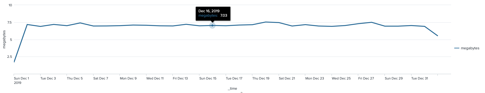
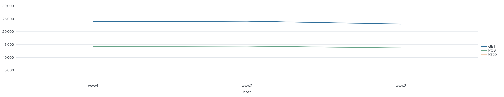
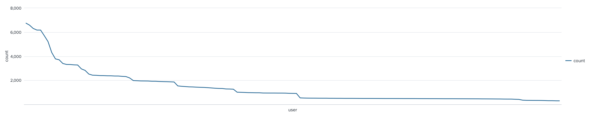

# Lab 5

## Tasks

* **Task 1:** Chart the total daily volume (in MB) of the web servers during the previous week.

```
index=web sourcetype=access_combined
| timechart sum(bytes) as bytes
| eval megabytes=round(bytes/(1024*1024),2) | fields - bytes
```



* **Task 2:** Calculate the ratio of GET requests to POST requests for each web server.

```
index=web sourcetype=access_combined | chart count over host by method
| eval Ratio=round(GET/POST,2)
```



* **Task 3:** Identify users with more than 3 failed logins during the last 60 minutes and sort in descending
order.

```
index=security sourcetype=linux_secure fail* | stats count by user
| search count>3
| sort -count
```



* **Task 4:** Classify and report employee web traffic by content type during the previous business week.

```
index=network sourcetype=cisco_wsa_squid
| stats count by http_content_type
| eval type=if(http_content_type LIKE "image%","graphic","other") | stats sum(count) as total by type
```


* **Task 5:** Report which products sold twice as much in the Buttercup Games online store than in the retail store during the previous week. Show the name of each of these products, as well as the number of units sold online and in the retail store.

```
(index=web sourcetype=access* action=purchase status=200) OR (index=sales sourcetype=vendor_sales)
| chart count(productId) as Count over product_name by sourcetype
| where access_combined > vendor_sales*2
```

