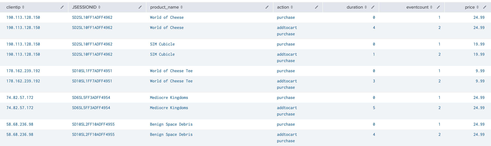

# Lab 6

## Tasks

* **Task 1:** Analyze transactions in the online store during the last 60 minutes.

```
index=web sourcetype="access_combined"
| transaction JSESSIONID
| table JSESSIONID,clientip, action
| search action=purchase
```


* **Task 2:** Display the online store purchase transactions lasting more than one minute and include the number of events in each transaction.

```
index=web sourcetype="access_combined"
| transaction JSESSIONID
| table JSESSIONID,clientip, duration,eventcount, action
| eval durationMinutes = round(duration/60,1)
| search action=purchase
| where durationMinutes > 1
| fields - duration
```


* **Task 3:** Search for online store transactions that begin with an addtocart action and end with a purchase action.

```
index=web sourcetype="access_combined"
| transaction clientip startswith="addtocart" endswith="purchase"
| table clientip, JSESSIONID, product_name, action duration,eventcount,price
```



* **Task 4:** 

```
```


* **Task 5:** 

```
```


