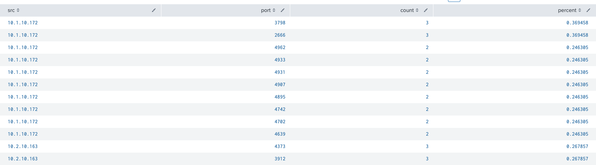

# Lab 8

## Tasks

* **Task 1:** Use the Field Extractor (FX) to extract the IP address and port fields using the Regular Expression method.

```
index=_* OR index=* sourcetype=linux_secure 
| top port by src
```



* **Task 2:** Use FX to extract fields using the delimiters method.

```
| loadjob 1578088946.41580_57C4CEF9-7D5F-42C9-AD28-CD9870154798 events=t ignore_running=f require_finished=f | search index=* OR index=_* sourcetype=SimCubeBeta | rex field=_raw "(?ms)^[^'\\n]*'(?P<User>[^']+)[^ \\n]* \\w+:'(?P<CharacterName>[^']+)'\\s+\\w+:'(?P<Action>[^']+)[^:\\n]*:'(?P<CurrentStanding>[^']+)" offset_field=_extracted_fields_bounds
```

