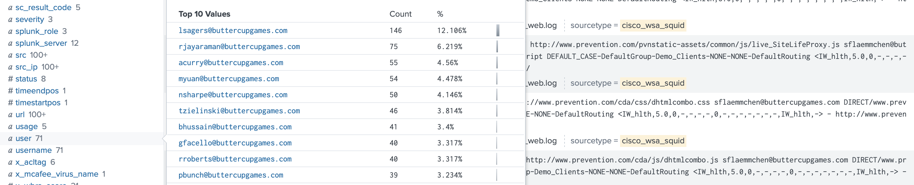

# Lab 9

## Tasks

* **Task 1:** Create a field alias so that cs_username also appears as user.

```
index=network sourcetype=cisco* user=*
```



* **Task 2:** Create a calculated field that converts bytes to MB.

```
index=network sourcetype=cisco_w* 
|  stats sum(sc_megabytes) as "Bandwidth (MB)" by usage
```


* **Task 3:** Create a field alias for the access_combined sourcetype called http_method, based on the existing access_combined field method.