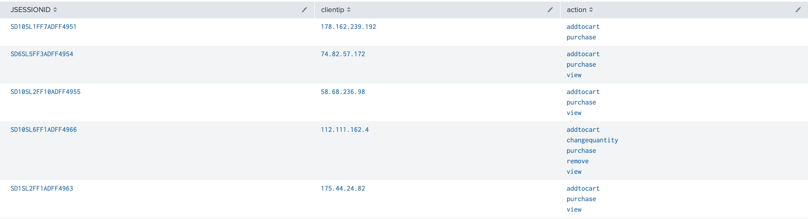

# Power User Lab Modules

## Content
* [Module 02 - Beyond Search Fundamentals](#Module-2)
* [Module 03 - Commands for Visualization](#Module-3)
* [Module 04 - Advanced Visualization](#Module-4)
* [Module 05 - Filtering and Formatting](#Module-5)
* [Module 06 - Corelating Events](#Module-6)
* [Module 08 - Field Extractions](#Module-8)
* [Module 09 - Aliases and Calculated Fields](#Module-9)
* [Module 10 - Tags and Event Type](#Module-10)
* [Module 11 - Macros](#Module-10)

### Module 2 

* Please find the Exercise PDF [here](./Mod2/SplunkFundamentals2_module2.pdf)
* Please find the Solution PDF [here](./Mod2/SplunkFundamentals2_module2_solutions.pdf)
* Please find the README File [here](#) **No Readme**

### Module 3 

* Please find the Exercise PDF [here](./Mod3/SplunkFundamentals2_module3.pdf)
* Please find the Solution PDF [here](./Mod3/SplunkFundamentals2_module3_solutions.pdf)
* Please find the README File [here](#) **No Readme**

### Module 4 

* Please find the Exercise PDF [here](./Mod4/SplunkFundamentals2_module4.pdf)
* Please find the Solution PDF [here](./Mod4/SplunkFundamentals2_module4_solutions.pdf)
* Please find the README File [here](./Mod4/README.md)

#### Tasks

* **Task 1:** Display web server failures during the last 7 days in a timechart with a trendline.

```
index=security sourcetype=linux_secure fail*
| timechart span=1d count as "Failures"
| trendline sma2(Failures) as Trend
```


* **Task 2:** Display the sales count of strategy games per day at Buttercup Games physical sales locations (i.e., not online) during the previous week.

```
index=sales sourcetype=vendor_sales categoryId="STRATEGY"
| timechart span=1d count
```


* **Task 3:** Display a choropleth map of United States retail sales during the last 7 Days.

```
index=sales sourcetype=vendor_sales
| where VendorID < 3000
| chart count over VendorStateProvince
| geom geo_us_states featureIdField=VendorStateProvince
```


* **Task 4:** Display a map of online sales by country during the previous week.

```
index=web sourcetype=access_combined action=purchase status=200
| iplocation clientip
| geostats latfield=lat longfield=lon count by clientip
```


* **Task 5:** Count the retail sales units sold by country and include a grand total row.

```
index=sales sourcetype=vendor_sales 
| chart count by VendorCountry
| rename count as "Units Sold"
| addtotals col=t row=f labelfield=VendorCountry label=Total
```


### Module 5 

* Please find the Exercise PDF [here](./Mod5/SplunkFundamentals2_module5.pdf)
* Please find the Solution PDF [here](./Mod5/SplunkFundamentals2_module5_solutions.pdf)
* Please find the README File [here](./Mod5/README.md)

#### Tasks

* **Task 1:** Chart the total daily volume (in MB) of the web servers during the previous week.

```
index=web sourcetype=access_combined
| timechart sum(bytes) as bytes
| eval megabytes=round(bytes/(1024*1024),2) | fields - bytes
```


* **Task 2:** Calculate the ratio of GET requests to POST requests for each web server.

```
index=web sourcetype=access_combined | chart count over host by method
| eval Ratio=round(GET/POST,2)
```


* **Task 3:** Identify users with more than 3 failed logins during the last 60 minutes and sort in descending
order.

```
index=security sourcetype=linux_secure fail* | stats count by user
| search count>3
| sort -count
```


* **Task 4:** Classify and report employee web traffic by content type during the previous business week.

```
index=network sourcetype=cisco_wsa_squid
| stats count by http_content_type
| eval type=if(http_content_type LIKE "image%","graphic","other") | stats sum(count) as total by type
```


* **Task 5:** Report which products sold twice as much in the Buttercup Games online store than in the retail store during the previous week. Show the name of each of these products, as well as the number of units sold online and in the retail store.

```
(index=web sourcetype=access* action=purchase status=200) OR (index=sales sourcetype=vendor_sales)
| chart count(productId) as Count over product_name by sourcetype
| where access_combined > vendor_sales*2
```


### Module 6

* Please find the Exercise PDF [here](./Mod6/SplunkFundamentals2_module6.pdf)
* Please find the Solution PDF [here](./Mod6/SplunkFundamentals2_module6_solutions.pdf)
* Please find the README File [here](./Mod6/README.md)

#### Tasks

* **Task 1:** Analyze transactions in the online store during the last 60 minutes.

```
index=web sourcetype="access_combined"
| transaction JSESSIONID
| table JSESSIONID,clientip, action
| search action=purchase
```



* **Task 2:** Display the online store purchase transactions lasting more than one minute and include the number of events in each transaction.

```
index=web sourcetype="access_combined"
| transaction JSESSIONID
| table JSESSIONID,clientip, duration,eventcount, action
| eval durationMinutes = round(duration/60,1)
| search action=purchase
| where durationMinutes > 1
| fields - duration
```


* **Task 3:** Search for online store transactions that begin with an addtocart action and end with a purchase action.

```
index=web sourcetype="access_combined"
| transaction clientip startswith="addtocart" endswith="purchase"
| table clientip, JSESSIONID, product_name, action duration,eventcount,price
```


* **Task 4:** Report common HTTP status errors that occurred during the last 30 days on the online sales web servers and the internal web appliance within a proximity of 5 minutes or less. Only include days with more than 5 common errors.


```
(index=network sourcetype=cisco_wsa_squid) OR (index=web sourcetype=access_combined) status>399
| fields sourcetype, status
| transaction status maxspan=1m
| timechart count by status
| addtotals
| where Total > 4
| fields - Total
```


### Module 8

* Please find the Exercise PDF [here](./Mod8/SplunkFundamentals2_module8.pdf)
* Please find the Solution PDF [here](./Mod8/SplunkFundamentals2_module8_solutions.pdf)
* Please find the README File [here](./Mod8/README.md)

#### Tasks

* **Task 1:** Use the Field Extractor (FX) to extract the IP address and port fields using the Regular Expression method.

```
index=_* OR index=* sourcetype=linux_secure 
| top port by src
```


* **Task 2:** Use FX to extract fields using the delimiters method.

```
| loadjob 1578088946.41580_57C4CEF9-7D5F-42C9-AD28-CD9870154798 events=t ignore_running=f require_finished=f | search index=* OR index=_* sourcetype=SimCubeBeta | rex field=_raw "(?ms)^[^'\\n]*'(?P<User>[^']+)[^ \\n]* \\w+:'(?P<CharacterName>[^']+)'\\s+\\w+:'(?P<Action>[^']+)[^:\\n]*:'(?P<CurrentStanding>[^']+)" offset_field=_extracted_fields_bounds
```


### Module 9

* Please find the Exercise PDF [here](./Mod9/SplunkFundamentals2_module9.pdf)
* Please find the Solution PDF [here](./Mod9/SplunkFundamentals2_module9_solutions.pdf)
* Please find the README File [here](./Mod9/README.md)

#### Tasks

* **Task 1:** Create a field alias so that cs_username also appears as user.

```
index=network sourcetype=cisco* user=*
```


* **Task 2:** Create a calculated field that converts bytes to MB.

```
index=network sourcetype=cisco_w* 
|  stats sum(sc_megabytes) as "Bandwidth (MB)" by usage
```


* **Task 3:** Create a field alias for the access_combined sourcetype called http_method, based on the existing access_combined field method.

### Module 10

* Please find the Exercise PDF [here](./Mod10/SplunkFundamentals2_module10.pdf)
* Please find the Solution PDF [here](./Mod10/SplunkFundamentals2_module10_solutions.pdf)
* Please find the README File [here](./Mod10/README.md)

#### Tasks

* **Task 1:** Create tags to identify all admin accounts.

```
index=security sourcetype=linux_secure failed tag=privileged_user
```


* **Task 2:** Use tags in a search.

```
index=security failed tag=privileged_user
```


* **Task 3:** Create an event type for status errors greater than 500 on web servers/devices.

```
index=web OR index=sales status>500 eventtype=web_error
```


### Module 11

* Please find the Exercise PDF [here](./Mod11/SplunkFundamentals2_module10.pdf)
* Please find the Solution PDF [here](./Mod11/SplunkFundamentals2_module10_solutions.pdf)
* Please find the README File [here](./Mod11/README.md)

#### Tasks

* **Task 1:** Write a basic macro to create a table displaying the total sales of each product sold in Europe.

```
index=sales sourcetype=vendor_sales ((VendorCountry="Germany") OR (VendorCountry="France") OR (VendorCountry="Italy"))
| stats sum(sale_price) as USD by product_name
| eval USD = "$" + tostring(USD,"commas")
```


* **Task 2:** Use a basic macro.

```
index=sales sourcetype=vendor_sales ((VendorCountry="Germany") OR (VendorCountry="France") OR (VendorCountry="Italy"))
| stats sum(sale_price) as USD by product_name
|`europe_sales`
```


* **Task 3:** Create a macro that enables users to specify currency when performing a search. This macro uses currency, currency symbol, and rate as variables (arguments).

```
sourcetype=vendor_sales VendorCountry=Germany OR VendorCountry=France OR VendorCountry=Italy
| stats sum(price) as USD by product_name
| eval euro = "€" + tostring(round(USD*0.79,2), "commas"), USD = "$" + tostring(USD, "commas")
```


* **Task 4:** Use your macro with arguments in a search.

```
sourcetype=vendor_sales VendorCountry=Germany OR VendorCountry=France OR VendorCountry=Italy
| `convert_sales(euro,€,.79)`
```

